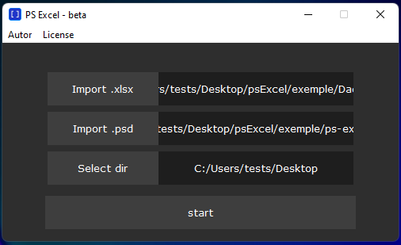
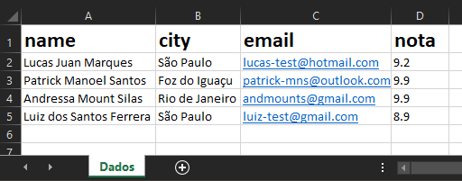
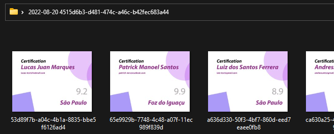

# psExcel
O psExcel é uma ferramenta para auxiliar na automatização de imagens geradas em massa com o Photoshop. Usa-se Common Object Model para controlar o Photoshop por meio do script.

Desenvolvido por patrick-mns em Python. Está é uma versão beta e conceitual.

Uma planilha simples .XLSX contendo os dados para cada imagem.

A imagem a ser gerada .PSD. Escolhi a marcação [ ] (square brackets/colchetes) para determinar o local para cada parte da tabela. O nome deve ser o mesmo da tabela (espaços vazios serão ignorados).

Em pouco tempo o psExcel executa suas tarefas e cria uma pasta com todas as imagens geradas.

